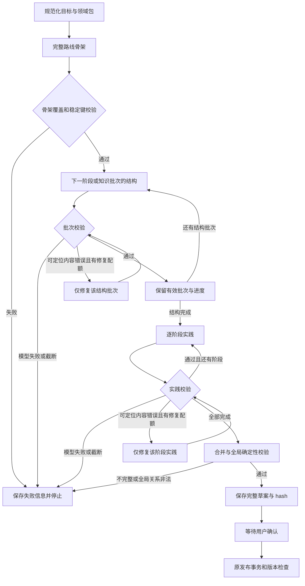

# B3-F2 大型路线分批生成设计（待评审）

## 意图与约束

根据用户目标文件 `C:/Users/22088/.codex/attachments/4d5b0972-1aad-4274-9443-27a87abd6bce/pasted-text-1.txt`：完整覆盖复杂方向，按阶段生成，失败立即停止，避免重复付费，最终仅以 Fake/MockTransport 验证。不调用真实付费 API，不修改或删除既有业务、Checkpoint、Attempt。保留 LangGraph、正式确认/发布、认证和 V6.3 界面。

基线 `ce7a749`；诊断见 `docs/acceptance/b3f2/M0-batched-generation-diagnosis.md`。

## 方案比较与选择

1. 仅增加单次预算：修改小，但整个路线仍可能截断，失败损失大；不满足 M2。
2. 在一个 Graph 节点内部循环所有阶段：减少输入，但每个阶段无法独立 checkpoint，崩溃恢复边界粗。
3. **选择在现有 planning_graph 中增加逐批循环**：每批结果校验并进入 checkpoint；账本保护重放，保留原确认/发布路径。不新增规划引擎。

## 数据与流程

骨架含所有阶段稳定键、目标、顺序、覆盖节点键与阶段前置键。已发布领域包的必需节点全部且唯一分配到阶段；Agent 当前九阶段、27 个必需节点全部保留。允许添加内容，禁止通过缩减要求修复截断。未受支持方向仍使用 search_only，不能伪装已核验资料。

新 State 增加生成协议版本、批次描述、当前索引、已验证结构批次、实践批次和修复目标。每个批次只含结构化内容及有限诊断，不保存完整提示词或密钥。每次 Graph 节点仅派发一个请求。

结构请求只含当前阶段描述、该阶段知识蓝图与已核验资源、必要外部依赖的键和简短标题。正常每阶段一批；过大阶段按预先确定的知识根/子树范围划分，不在付费截断后自动再次派发。跨批依赖键由完整骨架预先声明；局部校验允许这些已声明外部键，全局校验最终要求引用真实存在且无环。

实践请求只含当前阶段已验证节点、单元、目标及该阶段实践要求，任务须有目标、范围、排除项、验收标准与 core 关联。不得携带全路线节点。阶段资源引用以仓库领域包的已核验版本为权威，模型不能新增 verified 状态或替换来源。

合并按骨架顺序稳定排序；本地 order_index 验证后转换为现有全局序号。重复业务键直接失败，不能通过最后写入覆盖掩盖冲突。所有阶段和必要节点完成且整体校验通过后才调用原 save_draft；部分批次不是草案。

## 输出预算与模型适配

新增独立配置预算：outline 4096、structure 8192、practice 4096、repair 8192；沿用 LLM_MAX_OUTPUT_TOKENS 作为部署硬上限，默认仍 8000，因此 structure/repair 默认有效值为 8000。另配置兼容服务模型能力上限，实际值为 purpose 预算、部署硬上限、模型能力上限的最小值，非法配置在派发前拒绝。

官方 deepseek-flash 能力上限来自公开文档，当前 393216；仅用于限制而不默认分配如此大预算。其他兼容服务使用明确配置的上限；不能猜测它们支持 DeepSeek 参数。部署和个人模型工厂必须传递同一预算策略。

只向官方 `api.deepseek.com` 的已确认 deepseek-flash 发送 `thinking: {type: disabled}`。模型名称不匹配时保留通用协议并记录未适用，不宣称关闭成功。诊断记录 requested_model、响应 model、purpose/schema、max_tokens、thinking、finish_reason、content_chars、reasoning_chars、耗时和真实 usage；不记录思考文本、API Key、Authorization 或敏感提示词。

请求指纹覆盖实际预算、思考模式和生成协议版本，以阻止不同参数共用 Attempt。历史指纹只允许在原协议与原参数确实兼容时读取，不用新的批次请求重放旧全量结果。

## 失败、修复与恢复

Outline 任一模型失败立即终止。Structure/Practice 任一批次的模型失败、截断或空结果立即终止；不触发后续生成或自动截断重试。保留之前有效批次。dispatch_unknown 仍进入 reconciliation_required，不能以新 Attempt 绕过未知请求。

稳定 Attempt 格式包括 run_id、协议、purpose、stage_key、batch_index 和 repair_index；不能使用随机重试键。同一 Attempt 已成功或已失败时读取账本结果，不再次派发。派发状态或未知状态先核对，结果落库失败也不可盲目重试。

内容修复只用于明确可定位且获得完整响应的无效批次：例如缺目标修复其所属结构批次，缺单元修复该阶段结构，任务未知引用修复该阶段实践。每轮 run 共享最多两次修复预算；配额消耗进入 checkpoint。修复后只替换该批次并再次确定性校验。截断、传输未知和资源伪造不通过重新生成整套路线修复。

跨阶段关系完整性在合并验证层检查：领域包明确要求的边可从已审核蓝图构建；模型自创的缺失引用、循环或逆序关系失败，不能静默删除。整体错误无法定位时明确失败，不使用全量 repair Prompt。

新 run 使用新的图协议命名空间；旧已发布计划读路径保持原 DTO。旧等待确认 checkpoint 的 finish 保留兼容图分支，不能用新循环解释旧状态。新增恢复仅允许已有新协议、未 terminal 的中途 checkpoint：持有当前 advisory lock，先重放已保存结果，再继续尚未派发批次；待确认、失败和 reconciliation 状态不自动重启。验证租约与账本一致性，不能恢复出第二个草案或重复发布。

## 持久化与隐私

LLMResult 与 LLMFailure 均序列化为对象。未知 token、耗时、成本保持 NULL；真实零值才是 0。usage 按字段验证，非法类型不推算。合法响应与截断/非法 JSON 响应均保存相同的脱敏请求/响应诊断。HTTP 信封异常不泄漏正文，避免 AttributeError 漏出。

尽量将诊断保存在现有 response_payload，不新增业务数据库迁移。必要类型调整覆盖成本汇总读取方。现有 b3f2-v1 null 历史记录不回填、不修改。

## 验证与交付

先以失败测试固定每个里程碑，再实现。M1 测配置约束、两条工厂路径、模型/host 适配及指纹；M2 测九阶段/27 必需节点、局部输入、合并与关系；M3 测首/中/末失败、未知派发、重复执行和跨进程恢复；M4 测局部修复、范围隔离和共享两次配额；M5 MockTransport 测 length、完整/非法 JSON、reasoning 占用、无 usage、账本写入异常及安全重放；M6 测完整草案发布、hash/版本、旧计划读取和前端展示。

PostgreSQL 集成测试仅使用现有 test harness 的独立临时库；不对现有业务数据库或 Checkpoint 执行迁移、重置或清理。浏览器验收仅连接确定为 Fake 的独立本地服务，不能向当前真实模型服务 POST generate。

最终执行一次完整必要回归，保留实际命令与原始输出。交付修改文件表、流程图、有效预算表、单阶段和全路线 JSON、完整 Agent 示例、测试证据及明确延期项。结果使用 PASS/FAIL/NOT RUN。真实验证标记 NOT RUN。

## 将来受控真实验证建议

待用户另行确认后才运行。建议 deepseek-flash、关闭思考、完整九阶段、outline 4096 / structure 8000 / practice 4096 / repair 8000。正常请求数为 1 + 9 + 9 = 19；修复最多两次，总计至多 21。更大阶段预先拆批时按实际批次重新计算并在派发前说明上限。发生第一个模型失败即停，不能在未授权预算内无限续跑。这里的 Token 数是请求预算，不是实际消耗或费用承诺。

## 评审状态

已自查：无额外规划引擎；覆盖用户 M0–M6 与十项交付；没有真实调用；旧数据和未知结果保护保留。待用户审阅该设计后生成详细实施计划。尚未实施，测试状态不能据此报告 PASS。
