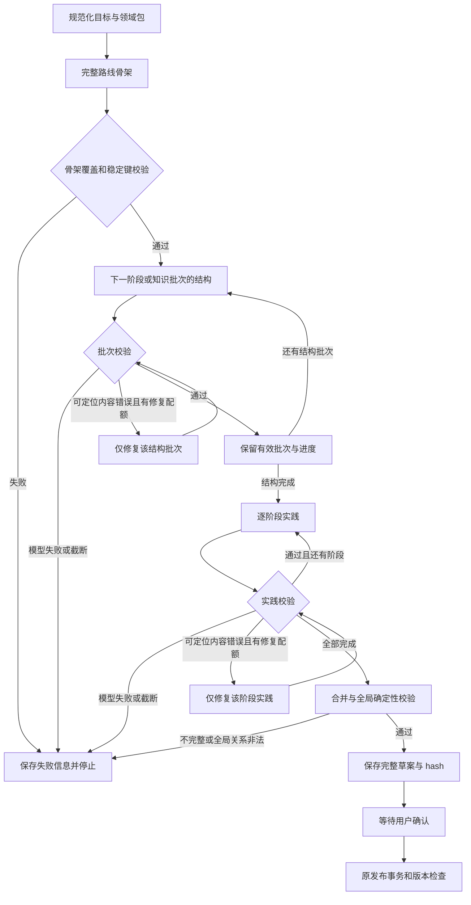

# B3-F2 大型路线分批生成设计（附条件通过，已合入评审意见）

## 意图与约束

根据用户目标文件 `C:/Users/22088/.codex/attachments/4d5b0972-1aad-4274-9443-27a87abd6bce/pasted-text-1.txt`：完整覆盖复杂方向，按阶段生成，失败立即停止，避免重复付费，最终仅以 Fake/MockTransport 验证。不调用真实付费 API，不修改或删除既有业务、Checkpoint、Attempt。保留 LangGraph、正式确认/发布、认证和 V6.3 界面。

基线 `ce7a749`；诊断见 `docs/acceptance/b3f2/M0-batched-generation-diagnosis.md`。

2026-09-29 用户评审七项修改已纳入下文。正式实施前先生成详细计划；无需再次审批这些明确修改。涉及破坏旧数据、修改旧迁移或变更正式发布语义时立即停止并报告。

## 最小持久化后台执行

当前 `routes.generate_plan` 虽返回 202，实际仍同步调用 `PlanService.generate`，不能将约十九次模型调用留在该请求中。改为 `submit_generation`：鉴权、校验输入和模型配置、冻结领域包及预算，在**一个业务库事务**中插入 queued Run、初始 `ai_run_events.detail` 和唯一 `ai_jobs`，提交后立即返回 run_id。请求中不调用 LLM、不启动 Graph，不使用 FastAPI BackgroundTasks 代替持久化队列。Worker 尚未启动时也能正确返回 queued。

复用 0001 中已有 ai_jobs 的 job_key/status/lease_token/lease_expires_at/worker_id/attempts/available_at，不改迁移。输入及冻结策略存在已有 ai_run_events.detail，进度也使用同表。Worker 一个独立进程、顺序执行，一次领取一个任务。运行命令需显式启动 Worker；API 只入队。进程级 advisory lock 保证只运行一个 Worker，claim 事务用行锁和 lease_token fencing；每个 Graph 步骤及落库前检查租约，长模型调用期间独立连接定期续租，失去租约停止后续派发。模型返回结果仍需尽量落 Attempt 账本，不因租约失效丢掉计费事实。

ai_jobs 已有按 Run 归属的 RLS，普通应用角色不能无项目上下文扫描全库。**`PLANNING_WORKER_ACTOR_IDS` 白名单仅供当前本地开发/安全验证；这会要求新注册用户人工登记，不能作为云端开放注册 V1 的最终领取机制。公开上线是阻断门：必须先提供无需逐用户登记且不扩大跨项目可见性的安全领取方式，并以并发、RLS/RBAC 和伪造项目测试验证；此前所有部署必须显式将功能标记为受限、只服务配置用户。**本地/安全验证的单 Worker 可在 actor 上下文查询 `learning_projects`，再逐项目领取任务并复核真实所有权；不使用迁移角色、不增加 BYPASSRLS、不修改策略。本实现将这个本地限制写入 README、Worker 启动错误和验收报告，未知 actor 的 run 不静默排队等待。

Worker 从冻结输入与 Run 身份重建授权范围，不保存浏览器 Cookie。个人模型配置绑定在入队时冻结版本，通过现有加密设置仓储取凭据，队列/事件只存配置引用；撤销或缺失凭据立即明确失败，不换用其他用户或静默回退。图执行结束后更新 waiting_user/failed/reconciliation_required，并完成任务，Run 的业务状态仍不代表已发布。GET /runs/{run_id} 不驱动模型，也不将有有效续租的运行仅因总时长超过旧同步阈值判定为中断。

## 方案比较与选择

1. 仅增加单次预算：修改小，但整个路线仍可能截断，失败损失大；不满足 M2。
2. 在一个 Graph 节点内部循环所有阶段：减少输入，但每个阶段无法独立 checkpoint，崩溃恢复边界粗。
3. **选择在现有 planning_graph 中增加逐批循环**：每批结果校验并进入 checkpoint；账本保护重放，保留原确认/发布路径。不新增规划引擎。

## 数据与流程

骨架含所有阶段稳定键、目标、顺序、覆盖节点键与阶段前置键。对已发布领域包，必需键、阶段归属、必要 contains/prerequisite 边、已核验资源由包提供确定性基线；不要求模型重复生成权威事实。模型在这些基线上个性化目标、补充内容和细化单元。Agent 当前九阶段、27 个必需节点全部保留且唯一归属，模型不得重分配、改键或更换权威资源。矛盾补充应报错，不能静默覆盖基线。未受支持方向使用 search_only，骨架阶段槽位默认 4 只用于冻结批次/请求预算；输出显著标示「通用结构，领域覆盖未验证」，资料待核验，不得称为完整或系统覆盖路线，也不得伪装已审核来源。

派发前冻结 execution_manifest：领域包版本及内容 hash、结构批次描述和数量、实践批次数量、各 purpose 最终预算、模型配置版本、思考模式、最大修复次数、最大请求数及输出预算总上限。受支持包在提交时冻结九阶段目录；骨架请求只补充个性化字段。search_only 的阶段数由配置固定的骨架槽位限制，模型填充其标题/范围，首版不支持模型任意增减批次数。每槽位可预划定结构子批次，不能在运行中无限拆批。冻结阶段数是安全执行边界，不是缩减受审核领域知识覆盖。

新 State 增加生成协议版本、批次描述、当前索引、已验证结构批次、实践批次和修复目标。每个批次只含结构化内容及有限诊断，不保存完整提示词或密钥。每次 Graph 节点仅派发一个请求。

结构请求只含当前阶段描述、该阶段知识蓝图与已核验资源、必要外部依赖的键和简短标题。正常每阶段一批；过大阶段按预先确定的知识根/子树范围划分，不在付费截断后自动再次派发。跨批依赖键由完整骨架预先声明；局部校验允许这些已声明外部键，全局校验最终要求引用真实存在且无环。

实践请求只含当前阶段已验证节点、单元、目标及该阶段实践要求，任务须有目标、范围、排除项、验收标准与 core 关联。不得携带全路线节点。阶段资源引用以仓库领域包的已核验版本为权威，模型不能新增 verified 状态或替换来源。

合并按骨架顺序稳定排序；本地 order_index 验证后转换为现有全局序号。重复业务键直接失败，不能通过最后写入覆盖掩盖冲突。所有阶段和必要节点完成且整体校验通过后才调用原 save_draft；部分批次不是草案。

## 输出预算与模型适配

新增独立配置预算并将部署硬上限 `LLM_MAX_OUTPUT_TOKENS` 默认修正为 8192，覆盖预设任务预算。配置项及生效值如下：

| purpose | 配置项 | 目标默认 | 部署硬上限默认 | 官方 Flash 能力上限 | 默认最终值 |
|---|---|---:|---:|---:|---:|
| outline | LLM_OUTLINE_OUTPUT_TOKENS | 4096 | 8192 | 393216 | 4096 |
| structure | LLM_STRUCTURE_OUTPUT_TOKENS | 8192 | 8192 | 393216 | 8192 |
| practice | LLM_PRACTICE_OUTPUT_TOKENS | 4096 | 8192 | 393216 | 4096 |
| repair | LLM_REPAIR_OUTPUT_TOKENS | 8192 | 8192 | 393216 | 8192 |

最终生效值必须同时满足目标预算、部署硬上限、实际模型能力上限。若任务目标超出任一硬上限，提交前明确返回配置冲突及三个数值，不静默压到 8000；用户可明确调整 purpose 配置。零、负数、布尔或非法类型在派发前拒绝。未知兼容模型的能力上限由 `LLM_MODEL_MAX_OUTPUT_TOKENS` 明确配置，不假设与 DeepSeek 相同。

官方 deepseek-flash 能力上限来自公开文档，当前 393216；仅用于限制而不默认分配如此大预算。其他兼容服务使用明确配置的上限；不能猜测它们支持 DeepSeek 参数。部署和个人模型工厂必须传递同一预算策略。

只向官方 `api.deepseek.com` 的已确认 deepseek-flash 发送 `thinking: {type: disabled}`。模型名称不匹配时保留通用协议并记录未适用，不宣称关闭成功。诊断记录 requested_model、响应 model、purpose/schema、max_tokens、thinking、finish_reason、content_chars、reasoning_chars、耗时和真实 usage；不记录思考文本、API Key、Authorization 或敏感提示词。

请求指纹覆盖实际预算、思考模式和生成协议版本，以阻止不同参数共用 Attempt。历史指纹只允许在原协议与原参数确实兼容时读取，不用新的批次请求重放旧全量结果。

## 失败、修复与恢复

Outline 任一模型失败立即终止。Structure/Practice 任一批次的模型失败、截断或空结果立即终止；不触发后续生成或自动截断重试。保留之前有效批次。dispatch_unknown 仍进入 reconciliation_required，不能以新 Attempt 绕过未知请求。

稳定 Attempt 格式包括 run_id、协议、purpose、stage_key、batch_index 和 repair_index；不能使用随机重试键。同一 Attempt 已成功或已失败时读取账本结果，不再次派发。派发状态或未知状态先核对，结果落库失败也不可盲目重试。

内容修复只用于明确可定位且获得完整响应的无效批次：例如缺目标修复其所属结构批次，缺单元修复该阶段结构，任务未知引用修复该阶段实践。每轮 run 共享最多两次修复预算；配额消耗进入 checkpoint。修复后只替换该批次并再次确定性校验。截断、传输未知和资源伪造不通过重新生成整套路线修复。

| 中断或结果 | 权威证据 | Worker 恢复行为 | 对外状态 |
|---|---|---|---|
| Attempt 成功落库，checkpoint 前中断 | 同 attempt_id 成功结果及相同请求指纹 | 以原键读取结果，重新确定性校验并推进该步；不再付费 | running，恢复后更新进度 |
| checkpoint 已记录有效批次 | 新协议 checkpoint 的完成索引及账本 | 从下个未派发批次继续；不重复累计计量或完成数 | running |
| dispatched 无可靠结果或结果写入失败 | 账本 dispatched/reconciliation_required | 停止并待核对；不能换 attempt_id，也不能当作未派发 | reconciliation_required |
| 模型明确失败，包括 length | failed Attempt 的失败对象；或旧 null + error_class | 若投影尚未来得及更新，重放失败并补齐终态；否则不再领取 | failed |
| 完整响应但内容校验失败 | 有效响应及确定性错误 | 只有当前有效执行、可定位、剩余整次修复配额时修复局部；配额耗尽或不可定位终止 | running 或 failed |
| waiting_user | 完整草案/hash 与 await_approval checkpoint | Worker 不恢复生成；仅已鉴权的决定接口可完成收尾 | waiting_user |
| 已发布/取消，checkpoint 收尾中断 | 原正式发布事务或取消事实 | 决定重放只确认已有业务结果，绝不再次发布或生成 | succeeded/cancelled；不一致则 reconciliation_required |

明确失败的 Run 不因 Worker 重启自动续跑；首版不实现失败 Run 的用户主动续跑。任务 attempts 是领取次数，不是模型重试许可；领取时先查 Run 终态、checkpoint 和账本，不能只看 lease 已过期。

跨阶段关系完整性在合并验证层检查：领域包明确要求的边可从已审核蓝图构建；模型自创的缺失引用、循环或逆序关系失败，不能静默删除。整体错误无法定位时明确失败，不使用全量 repair Prompt。

新 run 使用新的图协议命名空间；旧已发布计划读路径保持原 DTO。旧等待确认 checkpoint 的 finish 保留兼容图分支，不能用新循环解释旧状态。新增恢复仅允许已有新协议、未 terminal 的中途 checkpoint：持有当前 advisory lock，先重放已保存结果，再继续尚未派发批次；待确认、失败和 reconciliation 状态不自动重启。验证租约与账本一致性，不能恢复出第二个草案或重复发布。

保留当前 `build_planning_graph` 为旧协议装配（version 1 及既有版本），新批次图显式为 `b3f2-batch-v1`；旧 thread_id/namespace 不改写。finish 按 Run 保存的版本选择 builder，未知版本安全拒绝；不按当前默认版本猜测旧图。旧图测试必须用**改动前 39e79ad 代码**在独立临时 PostgreSQL 中生成真实 waiting_user checkpoint，再由新程序进程分别确认和取消；复制一个新图同构状态不算旧图兼容证据。验证原草案 hash、幂等发布记录、重复决定、模型调用数未增加，保留原发布事务先提交后 checkpoint 确认的语义。

## 整次 Run 预算与业务进度

Agent 基线结构九批、实践九批、骨架一批：正常请求 19，修复至多两次，最大 21。默认输出预算总上限为 `4096 + 9*8192 + 9*4096 + 2*8192 = 131072` tokens，属于最坏派发预算，既非预计真实用量，也非费用承诺。输入成本未知，V1 不伪造货币金额，不宣称输出预算约束总账单。

每次派发前在持有 Run 执行锁的账本事务中核对冻结清单、已占用请求数和预留输出预算；占用按唯一 attempt_id 计数。已存在结果的重放不再次占额度、不再次累计实际 tokens。unknown 仍占用额度。即便 repair_count/checkpoint 滞后，也以账本事实校验最大请求数和各 purpose 配额，不允许修改 manifest 扩容。计划不匹配或预算已耗尽时不派发。

业务进度包含 phase（outline/structure/practice/validation）、current_stage_index/title、total_stages、completed_structure_batches/total_structure_batches、completed_practice_batches/total_practice_batches、completed_batches、request_count/max_requests、真实 input_tokens/output_tokens 与 usage_complete、failure_stage/phase。计量缺失时保持 NULL，并可单独呈现已知部分合计；不得将缺失推算为 0。进度事件在 checkpoint 成功后更新；崩溃恢复可从 checkpoint/账本重新计算，因此事件重复不影响完成数。GET 返回有限业务投影，不输出 thread_id、图节点名、内部 checkpoint 或模型提示词。

前端显示“正在生成第 x/y 阶段 · 知识结构/实践任务”，配合已完成批次数；queued 显示等待执行，失败显示阶段与可理解原因，unknown 提示需核对。刷新浏览器继续轮询同 run_id；生成中禁用重复提交。waiting_user 后才显示完整草案，禁止展示部分批次为可发布成果。

## 持久化与隐私

LLMResult 与 LLMFailure 均序列化为对象。未知 token、耗时、成本保持 NULL；真实零值才是 0。usage 按字段验证，非法类型不推算。合法响应与截断/非法 JSON 响应均保存相同的脱敏请求/响应诊断。HTTP 信封异常不泄漏正文，避免 AttributeError 漏出。

尽量将诊断保存在现有 response_payload，不新增业务数据库迁移。必要类型调整覆盖成本汇总读取方。现有 b3f2-v1 null 历史记录不回填、不修改。

## 验证与交付

先以失败测试固定每个里程碑，再实现。M1 测配置约束、两条工厂路径、模型/host 适配及指纹；M2 测九阶段/27 必需节点、局部输入、合并与关系；M3 测首/中/末失败、未知派发、重复执行和跨进程恢复；M4 测局部修复、范围隔离和共享两次配额；M5 MockTransport 测 length、完整/非法 JSON、reasoning 占用、无 usage、账本写入异常及安全重放；M6 测完整草案发布、hash/版本、旧计划读取和前端展示。

增加 HTTP 立即返回（用阻塞 Fake 验证请求不等待 Worker）、Worker 强杀恢复、成功账本先于 checkpoint 的故障注入、截断立即停止、unknown 不重复付费、Run 总预算上限、租约丢失 fencing、旧 checkpoint 确认/取消和前端逐阶段进度反例。PostgreSQL 集成测试仅使用现有 test harness 的独立临时库；不对现有业务数据库或 Checkpoint 执行迁移、重置或清理。浏览器验收仅连接确定为 Fake 的独立本地服务，不能向当前真实模型服务 POST generate。

最终执行一次完整必要回归，保留实际命令与原始输出。交付修改文件表、流程图、有效预算表、单阶段和全路线 JSON、完整 Agent 示例、测试证据及明确延期项。结果使用 PASS/FAIL/NOT RUN。真实验证标记 NOT RUN。

## 将来受控真实验证建议

待用户另行确认后才运行。建议 deepseek-flash、关闭思考、完整九阶段、outline 4096 / structure 8192 / practice 4096 / repair 8192，部署硬上限至少 8192。正常请求数为 1 + 9 + 9 = 19；修复最多两次，总计至多 21。更大阶段预先拆批时按实际批次重新计算并在派发前说明上限。发生第一个模型失败即停，不能在未授权预算内无限续跑。这里的 Token 数是请求预算，不是实际消耗或费用承诺。

## 评审状态

已合入七项附条件评审意见，按用户指示直接生成详细实施计划，无需再次等待这些明确修改的审批。无额外规划引擎；覆盖用户 M0–M6 与十项交付；没有真实调用；旧数据和未知结果保护保留。尚未实施，测试状态不能据此报告 PASS。
